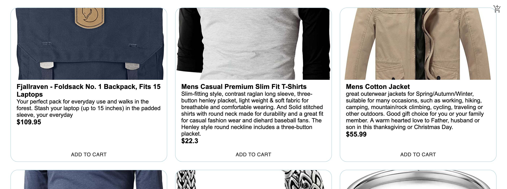
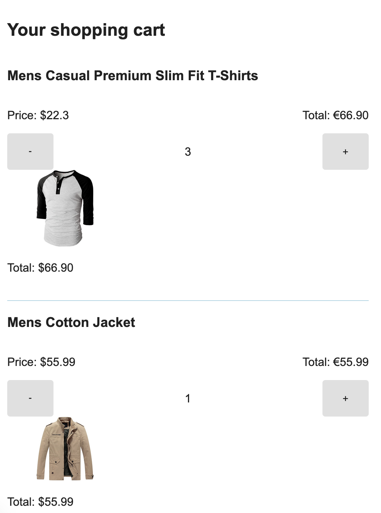

# Frontend Shopping Cart

A simple shopping cart built using react and typescript.

## Technologies used

Built with:

- HTML
- JS
- Reactjs
- TypeScript
- MaterialUI
- Fake Store API: https://fakestoreapi.com/

## Setup and usage

### `npm start`

Runs the app in the development mode.\
Open [http://localhost:3000](http://localhost:3000) to view it in the browser.

## Screenshots

 "Main View"

 "Solution view"

## Sources

- freeCodeCamp.org. Build a Shopping Cart with React and TypeScript - Tutorial: https://youtu.be/sfmL6bGbiN8

## Authors and acknowledgment

Abel Parada

- [GitHub @abel-parada](https://github.com/abel-parada)
- [LinkedIn](https://www.linkedin.com/in/abelparadamillan/)
